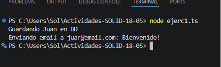
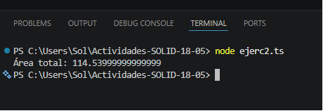
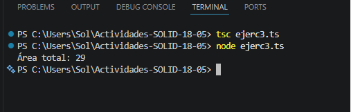
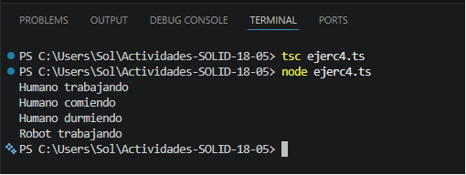
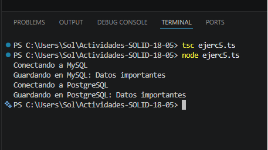
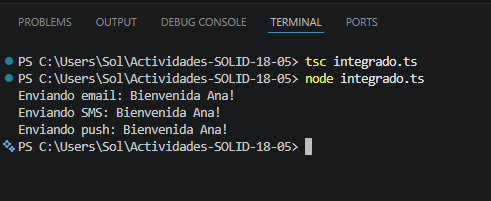

# Principios SOLID - Ejercicios Prácticos

Repositorio dedicado a la resolución de ejercicios prácticos aplicando los principios de diseño SOLID, desarrollado para la materia de Programación Orientada a Objetos.

## 👤 Información del Estudiante
* **Institución:** UPC Capilla del Monte
* **Carrera:** Programación Full Stack (2° año)
* **Materia:** Programación Orientada a Objetos (POO)
* **Profesor:** Narciso Perez
* **Alumna:** Sol De Francesco

---

## 🚀 Resoluciones y Evidencia de Ejecución

A continuación se presentan los bloques de código en TypeScript junto con sus respectivas capturas de pantalla de ejecución en la terminal.

### 1. SRP - Single Responsibility Principle (Principio de Responsabilidad Única)
Una clase debe tener una, y solo una, razón para cambiar.
* **Código:** `ejerc1.ts`
* **Resultado en Terminal:**

---

### 2. OCP - Open/Closed Principle (Principio de Abierto/Cerrado)
Las entidades de software deben estar abiertas para la extensión, pero cerradas para la modificación.
* **Código:** `ejerc2.ts`
* **Resultado en Terminal:**

---

### 3. LSP - Liskov Substitution Principle (Principio de Sustitución de Liskov)
Las subclases deben ser sustituibles por sus clases base sin alterar el correcto funcionamiento del programa.
* **Código:** `ejerc3.ts`
* **Resultado en Terminal:**

---

### 4. ISP - Interface Segregation Principle (Principio de Segregación de Interfaces)
Los clientes no deberían ser obligados a depender de interfaces que no utilizan.
* **Código:** `ejerc4.ts`
* **Resultado en Terminal:**

---

### 5. DIP - Dependency Inversion Principle (Principio de Inversión de Dependencias)
Depende de abstracciones, no de clases concretas.
* **Código:** `ejerc5.ts`
* **Resultado en Terminal:**

---

### 6. Ejemplo Integrado (Sistema de Notificaciones)
Caso práctico que integra la aplicación de múltiples principios SOLID en un flujo unificado.
* **Código:** `ejerc6.ts`
* **Resultado en Terminal:**

---

## 🛠️ Tecnologías Utilizadas
* **Lenguaje:** TypeScript
* **Entorno de Ejecución:** Node.js
* **Compilador:** TSC (TypeScript Compiler)
